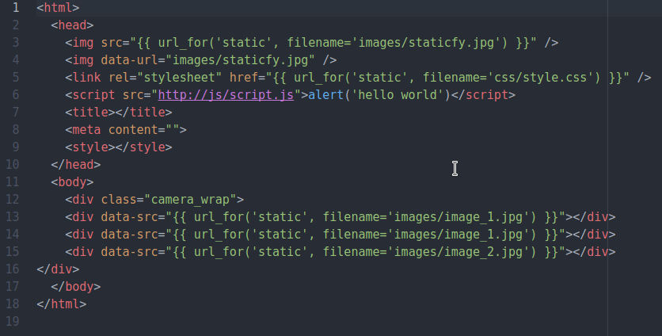

### Status
[](https://travis-ci.org/danidee10/Staticfy) [](https://codeclimate.com/github/danidee10/Staticfy)

# Staticfy
Have you ever been annoyed by the amount of time you spend manually changing the links in a html template you bought or downloaded until all the static files and assets are properly linked and the file looks exactly like the demo you saw online?
with Staticfy you can save that time (and some of your hair) by automatically converting the static urls in your template to dynamic flask url's that wouldn't break if you decide to move your file to another location.

`` ===> ``

# Usage
make the script executable with
```bash
sudo chmod +x staticfy.py`
```

and run it
```bash
./staticfy.py staticfy.html --static-endpoint=static --add-tags='{"img": "data-url"}'`
```

using `./` runs Staticfy with python3, if you're running windows or you want to use another version of python e.g python2, you can just run

```bash
python2 staticfy.py staticfy.html --static-endpoint=static --add-tags='{"img": "data-url"}'`
```

 `--static-endpoint` and `--add-tags` are optional

### Before Staticfying

---------------------------------------------------------------------------------------------------------------------------------
### After Staticfying


Notice how it preserves the font-awesome css link at the top of the file?, external resources (images, scripts, font-awesome, google-fonts, bootstrap files, disqus e.t.c) which aren't hosted locally with your website won't be staticfied. Staticfy also accepts an optional argument `--static-endpoint` in case you're not using the default static endpoint.

Staticy also preserves the indentation and formatting of any html file given to it, so your html file(s) are still look the same way and are still readablebe just the way they were before you staticfied them.

# Batch operation
Staticfy is also smart enough to know if it was given a single file or a directory to work with, if you want to staticfy all html files in a directory, just give staticfy the name of the directory that's all!.
staticfy will search through the specified folder and staticfy all the (html | htm) files it finds, this saves you more time if you want to staticfy a bunch of files at once.

```bash
./staticfy.py html_files'
```

# Additional tags and attributes
By default staticfy identifies and staticfies the following tags:
 1. img tags with src attributes -- ``
 2. link tags with rel attributes -- `<link rel="" />`
 3. script tags with src attributes -- `<script src="" />`

But it's common these days for javascript libraries (for a slider or animation) that have link to images (mostly) or other static resources. you can easily staticfy those tags by specifying the `--add-tags` argument and passing in a valid JSON string, an example is this slider from http://www.pixedelic.com/plugins/camera/, you can staticfy the div tags like this

```bash
./staticfy.py staticfy.html --add-tags='{"div": "data-src"}'`
```

and sure enough it gets staticfied

### Before staticfying


### After staticfying


You can exclude certain tags you don't want to be staticfied by specifying the `--exc-tags` parameter, like `--add-tags` it expects a valid JSON string.

```bash
./staticfy.py staticfy.html --exc-tags='{"img": "src"}'`
```
running that on a template should leave the img tags with the src attribute as they were in the original file.

It should be noted that sub folders containing html files won't be staticfied, only html files that exist in the specified directory will be staticfied. (this might change in the future)

Whenever you run staticfy on a template or on a folder, a staticfy folder is generated in the present working directory and the staticfied file(s) is placed in that folder, you also need to copy the file(s) over to the appropriate directory to overwrite the existing file with the new one.

# Tests
The tests are located in the `test.py` file and can be run with
`./test.py`

# Python support
Staticfy supports both python2 and python3
(python 2.7 >)

# Requirements and 3rd party stuff
Beautiful soup 4
`pip3 install bs4`
or you can use the requirements file `pip3 install -r requirements.txt`

if you have issues with importing HTML.parser on python 3.5, run this
`pip install --upgrade beautifulsoup4`

# Contribution
Pull requests and issues are welcome, if you're making a pull request, make sure
you respect the surrounding code style and write tests to show that your code
works, in your PR and commit also describe clearly what your PR attempts to
fix/improve/add
